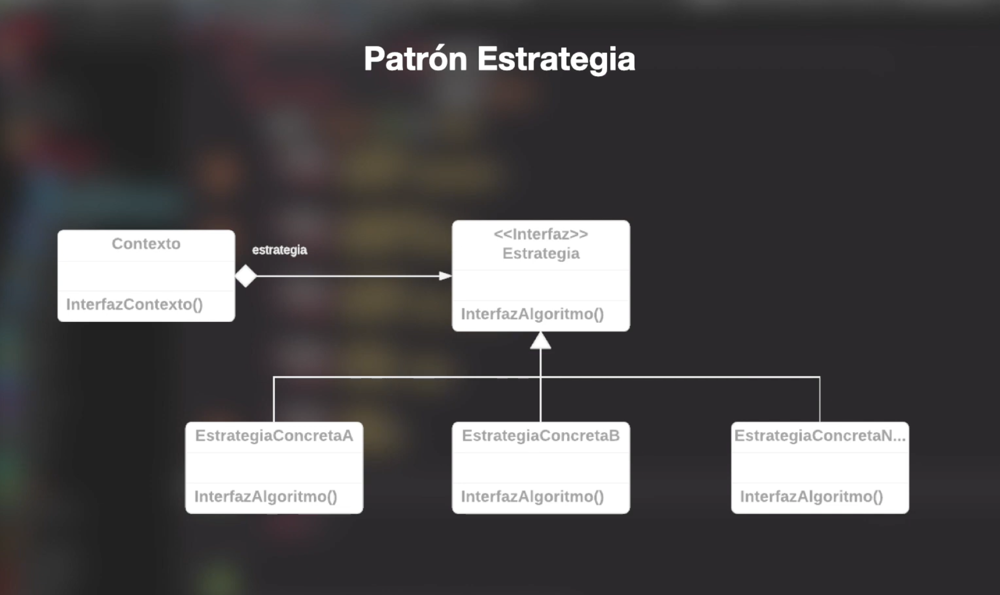

Patrón Estrategia (Strategy Pattern)
===================

Se clasifica como patrón de comportamiento (behavioral pattern), es decir, se centra en definir la forma en la que se produce el intercambio de mensajes entre distintos componentes.

Básicamente, su propósito es mantener un conjunto de algoritmos (estrategias) de entre los cuales el objeto cliente puede elegir aquel que le conviene e intercambiarlo dinámicamente según sus necesidades.

El Patrón Strategy define una familia de algoritmos, encapsula cada uno y luego los hace intercambiables. Esto se logra utilizando polimorfismo y nos permite desarrollar un sistema más flexible, puesto que, por ejemplo, agregar comportamientos adicionales no requerirá cambiar clases ya existentes en el sistema.

Diagrama UML
----------- 

