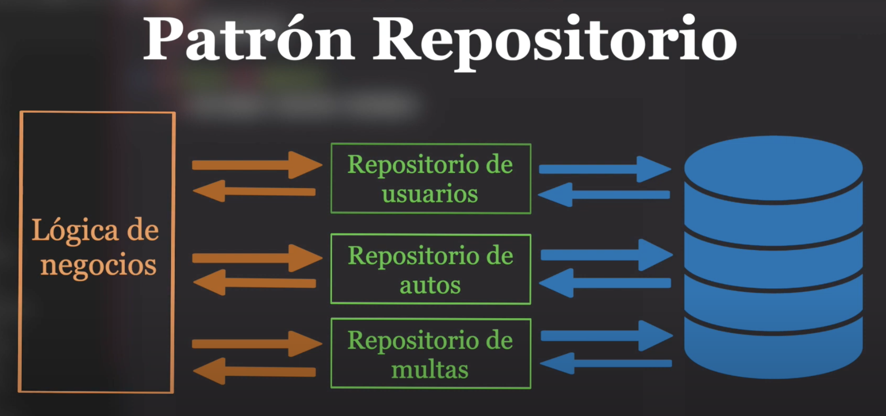

Patrón Repositorio (Repository Pattern)
===================

El patrón repositorio consiste en separar la lógica que recupera los datos y los asigna a un modelo de entidad de la lógica de negocios que actúa sobre el modelo, esto permite que la lógica de negocios sea independiente del tipo de dato que comprende la capa de origen de datos, en pocas palabras un repositorio media entre el dominio y las capas de mapeo de datos, actuando como una colección de objetos de dominio en memoria.

Diagrama
----------- 

